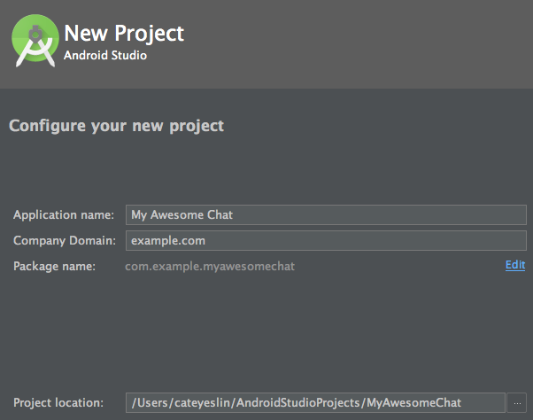
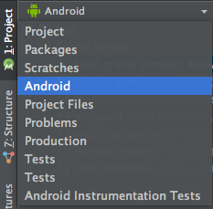
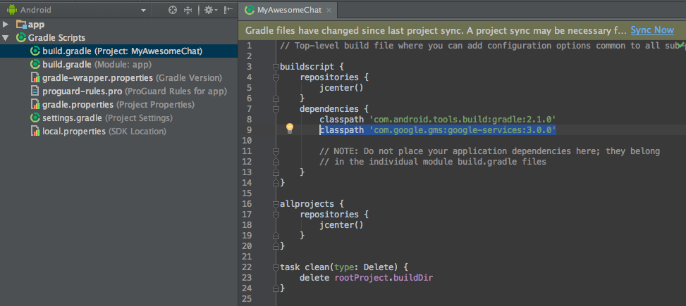
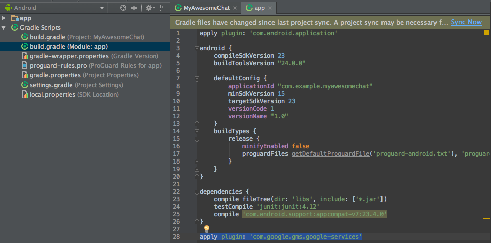
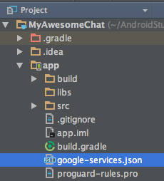

# Android 專案設定
本章目標為建立 Android 專案和完成 Firebase Console 提示你執行的設定。

## 懶人包
如果你很熟悉建立 Android 專案，可直接執行以下指令複製我的專案並替換掉 google-services.json 即可。

```
git clone https://github.com/CateyesLin/my-awesome-chat-start.git
git checkout 7a0d69a
```

## 建立 Android 專案
執行網頁上的最後一個動作。

1. 開啟 Android Studio，按上方工具列 `File` > `New` > `New Project`
2. 為了避免錯誤 Application Name 請統一輸入 `My Awesome Chat`，Company Domain 請統一輸入 `example.com`
3. 確認 Package Name 為 `com.example.myawesomechat`，按「Next」。<br/>
   
4. 選擇「Phone and Tablet」，並設定最低 SDK 為 16，按「Next」。因為這次使用到的部份元件最低支援版本為 16。
5. 選擇「Empty Activity」，按「Next」。
6. 直接按 Finish。

## 設定所需 Library
### 設定 Google Services
加入 Google Services

1. 切換專案到「Android」模式<br/>
   

2. 打開 build.gradle (Project: MyAwesomeChat) 在下面這段裡面加上 `classpath 'com.google.gms:google-services:3.0.0'`
   

   ```
   buildscript {
       repositories {
           ...
       }
       dependencies {
           ...
           //加在這裡
           classpath 'com.google.gms:google-services:3.0.0'
       }
   }
   ```

3. 打開另外一個 build.gradle (Module: app) 在最下面加上 `apply plugin: 'com.google.gms.google-services'`
   

4. 按下右上的「Sync Now」，將所需的 Library 下載。這個動作在後面會常常做。

5. 切換專案到「Project」模式<br/> 將從 Firebase Console 下載的 google-services.json 放到 app 下。<br/>
   

## 檢查點
將專案 Run 起來看看是否能夠成功 Build 好，出現「Hello World!」

### 恭喜你！你站上起跑線了！
[繼續下一章](my-awesome-chat-3.md)