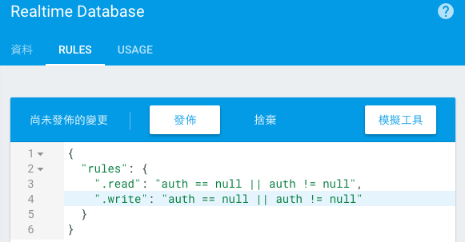

# 建立公開匿名聊天室
本章目標為做出一個可以進入公開匿名聊天室的進入點。

## 實作基本畫面
### gradle
打開 build.gradle (Module: app) 在 dependencies 內加上需要的 Library。一樣修改完後記得按右上角的「Sync Now」

[另存連結下載 keystore](sample-key-pwd-123456.keystore)

```
apply plugin: 'com.android.application'

android {
    ...
}

dependencies {
    ...
    //加在這裡，如下
    //如果上面有另外一個「com.android.support:appcompat-v7」請取代他
    compile 'com.android.support:design:23.4.0'
    compile 'com.android.support:appcompat-v7:23.4.0'
    compile 'com.github.bumptech.glide:glide:3.6.1'
    compile 'de.hdodenhof:circleimageview:1.3.0'
}

apply plugin: 'com.google.gms.google-services'
```

注意！檢查一下，如果已經升級到 SDK 24 或 25 的人，請注意修改 `compileSdkVersion` 和 `targetSdkVersion` 還有 `compile 'com.android.support:appcompat-v7:23.4.0'`在現在的 Android 都會要求你的 support library 要配合你的 SDK 大版本號。

如果不確定哪裡有錯，請複製完整 build.gradle 如下並且蓋過去原本的。
如果還有錯請檢查上面以下的版本有無配合為同一個大版本號，如：皆為 23 開頭。

- compileSdkVersion
- targetSdkVersion
- com.android.support:design
- com.android.support:appcompat-v7

```
apply plugin: 'com.android.application'

android {
    compileSdkVersion 23
    buildToolsVersion "24.0.1"

    defaultConfig {
        applicationId "com.example.myawesomechat"
        minSdkVersion 16
        targetSdkVersion 23
        versionCode 1
        versionName "1.0"
    }
    buildTypes {
        release {
            minifyEnabled false
            proguardFiles getDefaultProguardFile('proguard-android.txt'), 'proguard-rules.pro'
        }
    }
    //加上 signingConfigs 這段在 android {}內。
    signingConfigs {
        debug {
            keyAlias 'my-awesome-chat'
            keyPassword '123456'
            storeFile file('sample-key-pwd-123456.keystore')
            storePassword '123456'
        }
    }
}

dependencies {
    compile fileTree(dir: 'libs', include: ['*.jar'])
    testCompile 'junit:junit:4.12'
    compile 'com.android.support:appcompat-v7:23.4.0'
    compile 'com.android.support:design:23.4.0'
    compile 'com.github.bumptech.glide:glide:3.6.1'     // 讀取圖片用
    compile 'de.hdodenhof:circleimageview:1.3.0'        // 圓形 ImageView
}

apply plugin: 'com.google.gms.google-services'
```

### res

#### values

##### dimens.xml
在 `/app/src/main/res/values` 找到這個 xml，展開並打開第一個此檔名檔案，複製貼上取代全部內容。

```
<resources>
    <!-- Default screen margins, per the Android Design guidelines. -->
    <dimen name="activity_horizontal_margin">16dp</dimen>
    <dimen name="activity_vertical_margin">16dp</dimen>

    <dimen name="room_horizontal_padding">8dp</dimen>
    <dimen name="room_vertical_padding">16dp</dimen>

    <dimen name="message_horizontal_padding">8dp</dimen>
    <dimen name="message_vertical_padding">8dp</dimen>
</resources>
```


##### strings.xml
在 `/app/src/main/res/values` 找到這個 xml，並複製貼上取代全部內容。

```
<resources>
    <string name="app_name">Awesome Chat</string>
    <string name="welcome_msg">Welcome!</string>
    <string name="contacts_permission_rationale">Access to account information is required to sign in.</string>
    <string name="sign_in">登入</string>
    <string name="sign_out">登出</string>
    <string name="sign_up">註冊</string>
    <string name="fresh_config">更新設定</string>

    <string name="user_list">好友列表</string>
    <string name="room_list">聊天室列表</string>
    <string name="public_room">公開聊天室</string>
</resources>
```

#### drawable
將以下圖片分別複製到對應的資料夾內。直接開啟 res 資料夾，選取這五個資料夾 drawable-hdpi, drawable-mdpi, drawable-xhdpi, drawable-xxhdpi, drawable-xxxhdpi 點選 app > res 直接複製貼上到 `/app/src/main/res` 下。


#### layout

##### activity_main.xml
在 `/app/src/main/res/layout` 底下找到這個 xml，並複製貼上取代全部內容。

```
<?xml version="1.0" encoding="utf-8"?>
<RelativeLayout
    xmlns:android="http://schemas.android.com/apk/res/android"
    xmlns:tools="http://schemas.android.com/tools"
    xmlns:app="http://schemas.android.com/apk/res-auto"
    xmlns:ads="http://schemas.android.com/apk/res-auto"
    android:layout_width="match_parent"
    android:layout_height="match_parent"
    tools:context=".MainActivity">

    <LinearLayout android:id="@+id/public_room"
        android:layout_width="match_parent"
        android:layout_height="wrap_content"
        android:gravity="center_vertical"
        android:paddingTop="@dimen/room_vertical_padding"
        android:paddingBottom="@dimen/room_vertical_padding"
        android:paddingLeft="@dimen/room_horizontal_padding"
        android:paddingRight="@dimen/room_horizontal_padding"
        android:orientation="horizontal"
        android:background="?android:attr/selectableItemBackground">

        <de.hdodenhof.circleimageview.CircleImageView
            android:id="@+id/thumb"
            android:layout_width="36dp"
            android:layout_height="36dp"
            android:src="@drawable/ic_account_circle_black_36dp"/>

        <TextView android:id="@+id/display_name"
            android:layout_width="match_parent"
            android:layout_height="wrap_content"
            android:layout_marginStart="4dp"
            android:layout_marginLeft="4dp"
            android:textAppearance="?android:attr/textAppearanceLarge"
            android:layout_gravity="center_vertical"
            android:text="@string/public_room"
            tools:text="User Name" />

    </LinearLayout>

</RelativeLayout>
```

## 檢查點
執行看看，畫面已經出現公開聊天室了。
現在你已經會完成基本的畫面配置。

## 實作 Activity 之間的互動和值的傳遞
### gradle
這裡我們使用 Firebase 實作，加入 Firebase 所需要用到的 Library。
打開 build.gradle (Module: app) 在 dependencies 內加上需要的 Library。一樣修改完後記得按右上角的「Sync Now」

```
apply plugin: 'com.android.application'

android {
    ...
}

dependencies {
    ...
    //加在這裡，如下
    // Google
    compile 'com.google.android.gms:play-services-auth:10.0.1'   //提供 Firebase 做 OAuth 登入用的
    
    // Firebase
    compile 'com.google.firebase:firebase-database:10.0.1'   // 這次聊天主要都靠這個 Library
    compile 'com.google.firebase:firebase-auth:10.0.1'       // 幫助做使用者登入驗證
    compile 'com.google.firebase:firebase-config:10.0.1'     // 這次遠端變色就靠他了
    compile 'com.google.firebase:firebase-analytics:10.0.1'  // 使用者行為分析，這次並沒有用到
    compile 'com.google.android.gms:play-services-appinvite:10.0.1'  // 幫助寄送邀請的，這次並沒有用到
    compile 'com.google.firebase:firebase-messaging:10.0.1'      // 做推播的，這次並沒有用到
    compile 'com.google.android.gms:play-services-ads:10.0.1'    // 做廣告的，這次並沒有用到
    compile 'com.google.firebase:firebase-crash:10.0.1'      // 當機報告，這次並沒有用到
    
    //使用 FirebaseUI 要注意版本和 Firebase 的相依性，見 README https://github.com/firebase/FirebaseUI-Android
    compile 'com.firebaseui:firebase-ui-database:1.0.1'	//訊息和使用者列表的元件
    compile 'com.firebaseui:firebase-ui-auth:1.0.1'	    // FirebaseUI Auth only
    compile 'com.firebaseui:firebase-ui-storage:1.0.1'	// FirebaseUI Storage only
    compile 'com.firebaseui:firebase-ui:1.0.1'	// Single target that includes all FirebaseUI libraries above
    //到這為止
}

apply plugin: 'com.google.gms.google-services'
```

補充！此為 FirebaseUI 新版的小地雷！打開 build.gradle (Project: MyAwesomeChat) 在下面這段裡面加上 `maven { url 'https://maven.fabric.io/public' }`。否則會出現 `Error: Failed to resolve: com.twitter.sdk.android:twitter:2.0.0` 這個錯誤。

   ```
   allprojects {
       repositories {
           jcenter()

           // 加上這行
           maven { url 'https://maven.fabric.io/public' }
       }   
   }
   ```

### res
#### layout
##### activity_chatroom.xml
在 `/app/src/main/res/layout` 底下新增這個 xml，並複製貼上取代全部內容。

```
<?xml version="1.0" encoding="utf-8"?>
<RelativeLayout
    xmlns:android="http://schemas.android.com/apk/res/android"
    xmlns:tools="http://schemas.android.com/tools"
    xmlns:app="http://schemas.android.com/apk/res-auto"
    android:layout_width="match_parent"
    android:layout_height="match_parent"
    tools:context=".ChatRoomActivity">

    <android.support.v7.widget.RecyclerView
        android:id="@+id/message_recycler_view"
        android:layout_width="match_parent"
        android:layout_height="match_parent"
        android:layout_above="@+id/message_linear_layout"/>

    <LinearLayout
        android:id="@+id/message_linear_layout"
        android:layout_width="match_parent"
        android:layout_height="wrap_content"
        android:layout_alignParentBottom="true"
        android:layout_alignParentLeft="true"
        android:layout_alignParentStart="true"
        android:orientation="horizontal">

        <EditText
            android:id="@+id/message_edit_text"
            android:layout_width="0dp"
            android:layout_height="wrap_content"
            android:layout_gravity="center_vertical"
            android:layout_weight="1"/>

        <Button
            android:id="@+id/send_button"
            android:layout_width="wrap_content"
            android:layout_height="wrap_content"
            android:layout_gravity="bottom"
            android:enabled="false"
            android:text="SEND"/>

    </LinearLayout>

    <ProgressBar
        android:id="@+id/progress_bar"
        style="?android:attr/progressBarStyleLarge"
        android:layout_width="wrap_content"
        android:layout_height="wrap_content"
        android:layout_centerHorizontal="true"
        android:layout_centerVertical="true"/>

</RelativeLayout>
```

### 程式
#### java
##### BaseActivity
展開 `app/src/main/java/com/example/myawesomechat/` 在這底下新增一個此名稱的 java 檔案。複製貼上以下內容蓋掉原本的。

``` java
package com.example.myawesomechat;

import android.content.SharedPreferences;
import android.os.Bundle;
import android.preference.PreferenceManager;
import android.support.annotation.NonNull;
import android.support.v7.app.AppCompatActivity;
import android.util.Log;
import android.widget.Toast;

import com.google.android.gms.appinvite.AppInvite;
import com.google.android.gms.auth.api.Auth;
import com.google.android.gms.auth.api.signin.GoogleSignInOptions;
import com.google.android.gms.common.ConnectionResult;
import com.google.android.gms.common.api.GoogleApiClient;
import com.google.android.gms.tasks.OnFailureListener;
import com.google.android.gms.tasks.OnSuccessListener;
import com.google.firebase.analytics.FirebaseAnalytics;
import com.google.firebase.auth.FirebaseAuth;
import com.google.firebase.auth.FirebaseUser;
import com.google.firebase.database.DatabaseReference;
import com.google.firebase.database.FirebaseDatabase;
import com.google.firebase.remoteconfig.FirebaseRemoteConfig;
import com.google.firebase.remoteconfig.FirebaseRemoteConfigSettings;

import java.util.HashMap;
import java.util.Map;

public abstract class BaseActivity extends AppCompatActivity implements GoogleApiClient.OnConnectionFailedListener {

    private static final String TAG = BaseActivity.class.getSimpleName();

    public static final String ANONYMOUS = "anonymous";

    public static final String TITLE_COLOR_KEY = "title_color";
    public static final String DEFAULT_COLOR = "#000000";

    protected SharedPreferences mSharedPreferences;
    
    // Google 登入 API
    protected GoogleApiClient mGoogleApiClient;

    // 登入驗證用
    protected FirebaseAuth mFirebaseAuth;
    protected FirebaseUser mFirebaseUser;

    // 即時聊天所使用的 Realtime Database
    protected DatabaseReference mFirebaseDatabaseReference;

    // 讀取遠端 Config 用，後面會做變文字顏色用
    protected FirebaseRemoteConfig mFirebaseRemoteConfig;

    // 分析工具，目前沒用到
    protected FirebaseAnalytics mFirebaseAnalytics;

    @Override
    protected void onCreate(Bundle savedInstanceState) {
        super.onCreate(savedInstanceState);

        initFirebase();
        mSharedPreferences = PreferenceManager.getDefaultSharedPreferences(this);
    }

    @Override
    public void onStart() {
        super.onStart();
        mFirebaseUser = mFirebaseAuth.getCurrentUser();
    }

    @Override
    public void onPause() {
        super.onPause();
    }

    @Override
    public void onResume() {
        super.onResume();
    }

    @Override
    public void onDestroy() {
        super.onDestroy();
    }

    @Override
    public void onConnectionFailed(@NonNull ConnectionResult connectionResult) {
        // An unresolvable error has occurred and Google APIs (including Sign-In) will not
        // be available.
        Log.d(TAG, "onConnectionFailed:" + connectionResult);
        Toast.makeText(this, "Google Play Services error.", Toast.LENGTH_SHORT).show();
    }

    /**
     * 初始化要用到的 Firebase 變數才能使用他
     */
    private void initFirebase() {
        // Configure Google Sign In
        GoogleSignInOptions gso = new GoogleSignInOptions.Builder(GoogleSignInOptions.DEFAULT_SIGN_IN)
                .requestIdToken(getString(R.string.default_web_client_id))
                .requestEmail()
                .build();

        mGoogleApiClient = new GoogleApiClient.Builder(this)
                .enableAutoManage(this /* FragmentActivity */, this /* OnConnectionFailedListener */)
                .addApi(AppInvite.API)
                .addApi(Auth.GOOGLE_SIGN_IN_API, gso)
                .build();

        // Initialize Firebase Auth
        mFirebaseAuth = FirebaseAuth.getInstance();

        // Initialize Firebase RealtimeDatabase
        mFirebaseDatabaseReference = FirebaseDatabase.getInstance().getReference();

        mFirebaseAnalytics = FirebaseAnalytics.getInstance(this);

        // Initialize Firebase Remote Config.
        mFirebaseRemoteConfig = FirebaseRemoteConfig.getInstance();

        // Define Firebase Remote Config Settings.
        FirebaseRemoteConfigSettings firebaseRemoteConfigSettings =
                new FirebaseRemoteConfigSettings.Builder()
                        .setDeveloperModeEnabled(true)
                        .build();

        // Define default config values. Defaults are used when fetched config values are not
        // available. Eg: if an error occurred fetching values from the server.
        Map<String, Object> defaultConfigMap = new HashMap<>();
        defaultConfigMap.put(TITLE_COLOR_KEY, DEFAULT_COLOR);

        // Apply config settings and default values.
        mFirebaseRemoteConfig.setConfigSettings(firebaseRemoteConfigSettings);
        mFirebaseRemoteConfig.setDefaults(defaultConfigMap);

    }
}
```

##### ChatRoomActivity.java
展開 `app/src/main/java/com/example/myawesomechat/` 在這底下新增一個此名稱的 java 檔案。複製貼上取代全部內容。

``` java
package com.example.myawesomechat;

import android.os.Bundle;

public class ChatRoomActivity extends BaseActivity {

    private static final String TAG = ChatRoomActivity.class.getSimpleName();

    public final static String EXTRA_PREFIX = ChatRoomActivity.class.getName();
    public final static String EXTRA_ROOM_ID = EXTRA_PREFIX + ".ROOM_ID";

    @Override
    protected void onCreate(Bundle savedInstanceState) {
        super.onCreate(savedInstanceState);
        setContentView(R.layout.activity_chatroom);
    }
}
```


##### MainActivity.java
展開 `app/src/main/java/com/example/myawesomechat/` 找到這個檔案。
修改為繼承 `BaseActivity`

``` java
public class MainActivity extends BaseActivity {
    ...
}
```

1. 在最後面新增 openChatRoom 這個 function，功能為開啟聊天室頁面。
2. 在 onCreate 內新增 findViewById 這段，功能為點擊此區塊可以觸發開啟公開聊天室。
3. 上方新增 `PUBLIC_ROOM_ID` 常數為公開聊天室的 ID。

``` java
public class MainActivity extends BaseActivity {

    @Override
    protected void onCreate(Bundle savedInstanceState) {
        super.onCreate(savedInstanceState);
        setContentView(R.layout.activity_main);

        //新增這段
        findViewById(R.id.public_room).setOnClickListener(new View.OnClickListener() {
            @Override
            public void onClick(View v) {
                openChatRoom(Room.PUBLIC_ROOM_ID);
            }
        });
    }

    /**
     * 開啟到聊天室頁面
     */
    private void openChatRoom(String roomId) {
        Intent openChatroomForUser = new Intent(MainActivity.this, ChatRoomActivity.class)
                .putExtra(ChatRoomActivity.EXTRA_ROOM_ID, roomId);
        startActivity(openChatroomForUser);
    }
}
```

### AndroidManifest.xml
最後，打開 `app/manifest/AndroidManifest.xml`

- 新增 `<uses-permission android:name="android.permission.INTERNET" />` 到 <manifest> 後
- 新增 `<activity android:name=".ChatRoomActivity" />` 到 `</application>` 前。

注意位置不要擺錯！

```
<?xml version="1.0" encoding="utf-8"?>
<manifest xmlns:android="http://schemas.android.com/apk/res/android"
    package="com.example.myawesomechat">
    
    <!-- 新增使用網路的權限 -->
    <uses-permission android:name="android.permission.INTERNET" />

    <application
        ...>
        <activity android:name=".MainActivity">
            <intent-filter>
                <action android:name="android.intent.action.MAIN" />

                <category android:name="android.intent.category.LAUNCHER" />
            </intent-filter>
        </activity>

        <!-- 新增這段 -->
        <activity android:name=".ChatRoomActivity" />

    </application>

</manifest>
```

## 檢查點
執行看看，到這邊你已經可以點公開聊天室，進入聊天室的畫面了。
現在你已經會完成基本的 Activity 如何切換倒下一個 Activity。
但是目前還沒有辦法進行聊天，你應該已經開始期待進入正題了。

## 實作即時聊天

### res
#### layout
##### item_message.xml
在 `/app/src/main/res/layout` 底下新增這個 xml，並複製貼上取代全部內容。

```
<?xml version="1.0" encoding="utf-8"?>
<LinearLayout xmlns:android="http://schemas.android.com/apk/res/android"
    xmlns:tools="http://schemas.android.com/tools"
    android:layout_width="match_parent"
    android:layout_height="wrap_content"
    android:paddingTop="@dimen/message_vertical_padding"
    android:paddingBottom="@dimen/message_vertical_padding"
    android:paddingLeft="@dimen/message_horizontal_padding"
    android:paddingRight="@dimen/message_horizontal_padding"
    android:orientation="horizontal">

    <de.hdodenhof.circleimageview.CircleImageView
        android:id="@+id/messenger_thumb"
        android:layout_width="36dp"
        android:layout_height="36dp"
        android:src="@drawable/ic_account_circle_black_36dp"/>

    <LinearLayout
        android:layout_width="match_parent"
        android:layout_height="wrap_content"
        android:layout_marginLeft="10dp"
        android:gravity="center_vertical"
        android:orientation="vertical">

        <TextView
            android:id="@+id/messenger_text_view"
            android:layout_width="wrap_content"
            android:layout_height="wrap_content"
            android:layout_weight="0"
            android:textAppearance="?android:attr/textAppearanceSmall"
            tools:text="User name"/>

        <TextView
            android:id="@+id/message_text_view"
            android:layout_width="wrap_content"
            android:layout_height="wrap_content"
            android:layout_weight="0"
            android:textAppearance="?android:attr/textAppearanceLarge"
            tools:text="My Hello World Message. My Hello World Message. My Hello World Message. My Hello World Message."/>

    </LinearLayout>

</LinearLayout>
```

### 程式
#### Database model
##### Message.java
展開 `app/src/main/java/com/example/myawesomechat/` 在這裡面新增此 java 檔。複製底下內容蓋掉原本的。

``` java
package com.example.myawesomechat;

public class Message {

    public static final String CHILD_NAME = "messages";

    private String text;
    private String name;
    private String photoUrl;

    public Message() {
        //重要！空的 constructor 為 Firebase Realtime Database 必須要有的。
    }

    public Message(String text, String name, String photoUrl) {
        this.text = text;
        this.name = name;
        this.photoUrl = photoUrl;
    }

    public String getText() {
        return text;
    }

    public void setText(String text) {
        this.text = text;
    }

    public String getName() {
        return name;
    }

    public void setName(String name) {
        this.name = name;
    }

    public String getPhotoUrl() {
        return photoUrl;
    }

    public void setPhotoUrl(String photoUrl) {
        this.photoUrl = photoUrl;
    }
}
```

##### Room.java
展開 `app/src/main/java/com/example/myawesomechat/` 在這裡面新增此 java 檔。複製底下內容蓋掉原本的。

``` java
package com.example.myawesomechat;

import java.util.ArrayList;
import java.util.List;

public class Room {

    public static final String PUBLIC_ROOM_ID = "public_room_id";
    public static final String CHILD_NAME = "rooms";

    private List<Message> messages = new ArrayList<>();

    public Room() {
        // Default constructor required for calls to DataSnapshot.getValue(User.class)
    }

    public List<Message> getMessages() {
        return messages;
    }

    public void setMessages(List<Message> messages) {
        this.messages = messages;
    }

    public void addMessages() {
        this.messages = messages;
    }
}
```


#### java
##### ChatRoomActivity.java
展開 `app/src/main/java/com/example/myawesomechat/` 在這找到此名稱的 java 檔案。
以下如果有發現一些編譯前的錯誤，使用「Alt + Enter > Import Class」即可。

在這 Class 結尾前加上這一段，這是用來顯示訊息的 ViewHolder。

``` java
    public static class MessageViewHolder extends RecyclerView.ViewHolder {

        public final static int layoutResId = R.layout.item_message;

        public TextView messageTextView;
        public TextView messengerTextView;
        public CircleImageView messengerImageView;

        public MessageViewHolder(View v) {
            super(v);
            messageTextView = (TextView) itemView.findViewById(R.id.message_text_view);
            messengerTextView = (TextView) itemView.findViewById(R.id.messenger_text_view); 
            messengerImageView = (CircleImageView) itemView.findViewById(R.id.messenger_thumb);
        }
    }
```

在 Class 裡的最前面宣告一些等等要用到的成員變數。

```
    private String chatRoomId;
    private RecyclerView messageRecyclerView;

    private Button mSendButton;
    private LinearLayoutManager mLinearLayoutManager;
    private ProgressBar mProgressBar;
    private EditText mMessageEditText;

    // Firebase instance variables
    private DatabaseReference messagesReference;
    private FirebaseRecyclerAdapter<Message, MessageViewHolder> mFirebaseAdapter;
```

在此 Class 內宣告此 function 將之前設定進去的 layout 內的 View 做綁定和行為設定。

``` java
    private void initView() {
        messageRecyclerView = (RecyclerView) findViewById(R.id.message_recycler_view);
        // Initialize ProgressBar and RecyclerView.
        mProgressBar = (ProgressBar) findViewById(R.id.progress_bar);
        
        //設定好聊天室要接的訊息列表
        mLinearLayoutManager = new LinearLayoutManager(this);
        mLinearLayoutManager.setStackFromEnd(true);
        messageRecyclerView.setLayoutManager(mLinearLayoutManager);

        //利用 Firebase UI 來幫我們簡單的達成接回訊息顯示以及訊息更新會自動更新畫面。
        mFirebaseAdapter = new FirebaseRecyclerAdapter<Message, MessageViewHolder>(
                Message.class,
                MessageViewHolder.layoutResId,
                MessageViewHolder.class,
                messagesReference) {

            @Override
            protected void populateViewHolder(MessageViewHolder viewHolder,
                                              Message message, int position) {
                mProgressBar.setVisibility(ProgressBar.INVISIBLE);
                viewHolder.messageTextView.setText(message.getText());

                String name = message.getName();
                viewHolder.messengerTextView.setText(null == name ? ANONYMOUS : name);
                if (message.getPhotoUrl() == null) {
                    viewHolder.messengerImageView.setImageDrawable(
                            ContextCompat.getDrawable(ChatRoomActivity.this, R.drawable.ic_account_circle_black_36dp));
                } else {
                    Glide.with(ChatRoomActivity.this)
                            .load(message.getPhotoUrl())
                            .into(viewHolder.messengerImageView);
                }
            }
        };

        //當有新訊息時捲動到最新的訊息
        mFirebaseAdapter.registerAdapterDataObserver(new RecyclerView.AdapterDataObserver() {
            @Override
            public void onItemRangeInserted(int positionStart, int itemCount) {
                super.onItemRangeInserted(positionStart, itemCount);
                int friendlyMessageCount = mFirebaseAdapter.getItemCount();
                int lastVisiblePosition =
                        mLinearLayoutManager.findLastCompletelyVisibleItemPosition();
                // If the recycler view is initially being loaded or the
                // user is at the bottom of the list, scroll to the bottom
                // of the list to show the newly added message.
                if (lastVisiblePosition == -1 ||
                        (positionStart >= (friendlyMessageCount - 1) &&
                                lastVisiblePosition == (positionStart - 1))) {
                    messageRecyclerView.scrollToPosition(positionStart);
                }
            }
        });

        messageRecyclerView.setLayoutManager(mLinearLayoutManager);
        messageRecyclerView.setAdapter(mFirebaseAdapter);

        mMessageEditText = (EditText) findViewById(R.id.message_edit_text);
        mMessageEditText.addTextChangedListener(new TextWatcher() {
            @Override
            public void beforeTextChanged(CharSequence charSequence, int i, int i1, int i2) {
            }

            @Override
            public void onTextChanged(CharSequence charSequence, int i, int i1, int i2) {
                //在沒有輸入訊息時，不能按送出
                if (charSequence.toString().trim().length() > 0) {
                    mSendButton.setEnabled(true);
                } else {
                    mSendButton.setEnabled(false);
                }
            }

            @Override
            public void afterTextChanged(Editable editable) {
            }
        });

        mSendButton = (Button) findViewById(R.id.send_button);
        mSendButton.setOnClickListener(new View.OnClickListener() {
            @Override
            public void onClick(View view) {
                String userName = ANONYMOUS;
                String photoUrl = null;
                if(null != mFirebaseUser) {
                    userName = mFirebaseUser.getDisplayName();
                    if (null != mFirebaseUser.getPhotoUrl()) {
                        photoUrl = mFirebaseUser.getPhotoUrl().toString();
                    }
                }

                //按送出時，將訊息寫入到 Realtime Database
                Message message = new
                        Message(mMessageEditText.getText().toString(),
                        userName,
                        photoUrl);
                messagesReference.push().setValue(message);
                mMessageEditText.setText("");
            }
        });
    }
```

在 `onCreate()` 結尾前加上以下幾行
每個聊天室都有自己的 ID，才不會讀錯訊息。

``` java
    @Override
    protected void onCreate(Bundle savedInstanceState) {
        super.onCreate(savedInstanceState);
        setContentView(R.layout.activity_chatroom);
        
        //加上以下這段
        chatRoomId = getIntent().getStringExtra(EXTRA_ROOM_ID);
        messagesReference = mFirebaseDatabaseReference.child(Room.CHILD_NAME).child(chatRoomId).child(Message.CHILD_NAME);  //將列表要顯示的資料集指定到我們設計的訊息資料結構上。
        initView();
        //到這邊為止
    }
```

### Firebase Console
#### Database
回到瀏覽器上剛剛建立的專案，點左邊的「Database」。在右邊的區塊，點選「RULES」。



將以下內容複製蓋掉原本的內容後，按下「發佈」。

```
{
  "rules": {
    ".read": "auth == null || auth != null",
    ".write": "auth == null || auth != null"
  }
}
```

等同設為 `true` 也就是任何人都可以讀寫，當然實際要使用時應該要針對這部份調整為你需要的。

## 檢查點

一邊讓他執行 Build，同時在開始傳訊息前，不妨切回 Firebase Console 上「Database」的「資料」。在傳訊息前先看一下資料下的內容，一邊傳你也會發現資料不斷的在網頁上新增。

拿左右鄰居的手機試著安裝看看，就可以兩個人互相匿名聊天。

注意！因為 package name 一樣，所以安裝前必須先移除他手機上的這個程式。

```
adb uninstall com.example.myawesomechat
```

恭喜你，你的第一個即時聊天 App 已經完成了。

[繼續下一章](my-awesome-chat-4.md)
