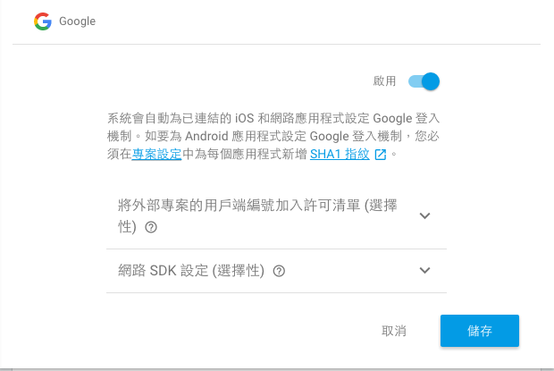

# 建立一對一的聊天室
本章目標為做出一個使用者列表和一對一聊天室。


## res
### layout
#### item_user.xml
在 `/app/src/main/res/layout` 底下新增這個 xml，並複製貼上取代全部內容。

```
<?xml version="1.0" encoding="utf-8"?>
<LinearLayout xmlns:android="http://schemas.android.com/apk/res/android"
    xmlns:tools="http://schemas.android.com/tools"
    android:layout_width="match_parent"
    android:layout_height="wrap_content"
    android:gravity="center_vertical"
    android:paddingTop="@dimen/room_vertical_padding"
    android:paddingBottom="@dimen/room_vertical_padding"
    android:paddingLeft="@dimen/room_horizontal_padding"
    android:paddingRight="@dimen/room_horizontal_padding"
    android:orientation="horizontal"
    android:background="?android:attr/selectableItemBackground">

    <de.hdodenhof.circleimageview.CircleImageView
        android:id="@+id/thumb"
        android:layout_width="36dp"
        android:layout_height="36dp"
        android:src="@drawable/ic_account_circle_black_36dp"/>

    <TextView android:id="@+id/display_name"
        android:layout_width="match_parent"
        android:layout_height="wrap_content"
        android:layout_marginStart="4dp"
        android:layout_marginLeft="4dp"
        android:textAppearance="?android:attr/textAppearanceLarge"
        android:layout_gravity="center_vertical"
        tools:text="User Name" />

</LinearLayout>
```

#### activity_main.xml
在 `/app/src/main/res/layout` 底下打開這個 xml，將以下這段加在 `</RelativeLayout>` 之前。因為 RelativeLayout 是依照裡面的上到下順序將 View 疊加上去。如果沒在最後面，會被其他 View 蓋住。

```
    <android.support.v7.widget.RecyclerView android:id="@+id/user_recycler_view"
        android:layout_width="match_parent"
        android:layout_height="match_parent"
        android:layout_below="@id/public_room"/>

    <ProgressBar
        android:id="@+id/progress_bar"
        style="?android:attr/progressBarStyleLarge"
        android:layout_width="wrap_content"
        android:layout_height="wrap_content"
        android:layout_centerHorizontal="true"
        android:layout_centerVertical="true"/>
        
    <com.google.android.gms.common.SignInButton
        android:id="@+id/sign_in_button"
        android:layout_width="wrap_content"
        android:layout_height="wrap_content"
        android:layout_centerInParent="true"
        android:visibility="visible"
        android:layout_gravity="center"/>
```

最後結果會像這樣。

```
<?xml version="1.0" encoding="utf-8"?>
<RelativeLayout
    xmlns:android="http://schemas.android.com/apk/res/android"
    xmlns:tools="http://schemas.android.com/tools"
    xmlns:app="http://schemas.android.com/apk/res-auto"
    xmlns:ads="http://schemas.android.com/apk/res-auto"
    android:layout_width="match_parent"
    android:layout_height="match_parent"
    tools:context=".MainActivity">

    <LinearLayout android:id="@+id/public_room"
        android:layout_width="match_parent"
        android:layout_height="wrap_content"
        android:gravity="center_vertical"
        android:paddingTop="@dimen/room_vertical_padding"
        android:paddingBottom="@dimen/room_vertical_padding"
        android:paddingLeft="@dimen/room_horizontal_padding"
        android:paddingRight="@dimen/room_horizontal_padding"
        android:orientation="horizontal"
        android:background="?android:attr/selectableItemBackground">

        <de.hdodenhof.circleimageview.CircleImageView
            android:id="@+id/thumb"
            android:layout_width="36dp"
            android:layout_height="36dp"
            android:src="@drawable/ic_account_circle_black_36dp"/>

        <TextView android:id="@+id/display_name"
            android:layout_width="match_parent"
            android:layout_height="wrap_content"
            android:layout_marginStart="4dp"
            android:layout_marginLeft="4dp"
            android:textAppearance="?android:attr/textAppearanceLarge"
            android:layout_gravity="center_vertical"
            android:text="@string/public_room"
            tools:text="User Name" />

    </LinearLayout>

    <android.support.v7.widget.RecyclerView android:id="@+id/user_recycler_view"
        android:layout_width="match_parent"
        android:layout_height="match_parent"
        android:layout_below="@id/public_room"/>

    <ProgressBar
        android:id="@+id/progress_bar"
        style="?android:attr/progressBarStyleLarge"
        android:layout_width="wrap_content"
        android:layout_height="wrap_content"
        android:layout_centerHorizontal="true"
        android:layout_centerVertical="true"/>
        
    <com.google.android.gms.common.SignInButton
        android:id="@+id/sign_in_button"
        android:layout_width="wrap_content"
        android:layout_height="wrap_content"
        android:layout_centerInParent="true"
        android:visibility="visible"
        android:layout_gravity="center"/>

</RelativeLayout>
```

### 程式
#### java
##### User.java
展開 `app/src/main/java/com/example/myawesomechat/` 在這裡面新增此 java 檔。複製底下內容蓋掉原本的。

``` java
package com.example.myawesomechat;

import android.net.Uri;
import android.support.annotation.NonNull;

import com.google.firebase.auth.FirebaseUser;

public class User {

    public static final String CHILD_NAME = "users";

    private String uid;
    private String email;
    private String displayName;
    private String photoUrl;

    public User() {
        // Default constructor required for calls to DataSnapshot.getValue(User.class)
    }

    public User(String uid, String email, String displayName, String photoUrl) {
        this.uid = uid;
        this.email = email;
        this.displayName = displayName;
        this.photoUrl = photoUrl;
    }

    public static User fromFirebaseUser(@NonNull FirebaseUser firebaseUser) {
        Uri photoUrl = firebaseUser.getPhotoUrl();
        return new User(
                firebaseUser.getUid(),
                firebaseUser.getEmail(),
                firebaseUser.getDisplayName(),
                null == photoUrl ? null : photoUrl.toString()
        );
    }

    public String getEmail() {
        return email;
    }

    public void setEmail(String email) {
        this.email = email;
    }

    public String getDisplayName() {
        return displayName;
    }

    public void setDisplayName(String displayName) {
        this.displayName = displayName;
    }

    public String getPhotoUrl() {
        return photoUrl;
    }

    public void setPhotoUrl(String photoUrl) {
        this.photoUrl = photoUrl;
    }

    public String getUid() {
        return uid;
    }

    public void setUid(String uid) {
        this.uid = uid;
    }
}
```

##### MainActivity.java
展開 `app/src/main/java/com/example/myawesomechat/` 在這找到此名稱的 java 檔案。
以下如果有發現一些編譯前的錯誤，使用「Alt + Enter > Import Class」即可。

在這 Class 結尾前加上下面這一段，這是用來顯示使用者的 ViewHolder。

``` java
    public static class UserViewHolder extends RecyclerView.ViewHolder {

        public final static int layoutResId = R.layout.item_user;

        public TextView displayNameTextView;
        public CircleImageView thumbImageView;

        public UserViewHolder(View v) {
            super(v);
            displayNameTextView = (TextView) itemView.findViewById(R.id.display_name);
            thumbImageView = (CircleImageView) itemView.findViewById(R.id.thumb);
        }
    }
```

在這 Class 前面加上下面這一段，宣告一些等一下要操作的 View。

``` java
    private static final String TAG = MainActivity.class.getSimpleName();
    
    private static final int REQ_SIGN_IN = 1001;
    
    private SignInButton signInButton;
    
    private RecyclerView userRecyclerView;
    private LinearLayoutManager mLinearLayoutManager;
    private FirebaseRecyclerAdapter<User, UserViewHolder> mFirebaseAdapter;
    
    private ProgressBar mProgressBar;
```

在這 Class 內貼上下面這段 Code，做 View 的繫結和設定。

``` java
    private void initView() {
        //加上登入按鈕
        signInButton = (SignInButton) findViewById(R.id.sign_in_button);
        signInButton.setOnClickListener(new View.OnClickListener() {
            @Override
            public void onClick(View v) {
                Intent signInIntent = Auth.GoogleSignInApi.getSignInIntent(mGoogleApiClient);
                startActivityForResult(signInIntent, REQ_SIGN_IN);
            }
        });
        
        //加上使用者列表
        userRecyclerView = (RecyclerView) findViewById(R.id.user_recycler_view);
        // Initialize ProgressBar and RecyclerView.
        mProgressBar = (ProgressBar) findViewById(R.id.progress_bar);
        mLinearLayoutManager = new LinearLayoutManager(this);
        userRecyclerView.setLayoutManager(mLinearLayoutManager);
    }
```

在 onCreate() 這個 function 內最後面加上 `initView()`。

```
    @Override
    protected void onCreate(Bundle savedInstanceState) {
        super.onCreate(savedInstanceState);
        setContentView(R.layout.activity_main);
        
        findViewById(R.id.public_room).setOnClickListener(new View.OnClickListener() {
            @Override
            public void onClick(View v) {
                openChatRoom(PUBLIC_ROOM_ID);
            }
        });

        //新增這段
        initView();
    }
```

將以下這段加在 onCreate() 這個 function 下面。
- 控制 View 在根據是否登入做出變化。
- 處理 OAuth 登入後到 Firebase 進行驗證登入。
- Firebase 登入後，新增使用者到資料庫內。

```
    @Override
    public void onStart() {
        super.onStart();
        if (mFirebaseUser != null) {

        }
        setupView();
    }

    @Override
    public void onActivityResult(int requestCode, int resultCode, Intent data) {
        super.onActivityResult(requestCode, resultCode, data);

        // Result returned from launching the Intent from GoogleSignInApi.getSignInIntent(...);
        if (requestCode == REQ_SIGN_IN) {
            GoogleSignInResult result = Auth.GoogleSignInApi.getSignInResultFromIntent(data);
            Log.d(TAG, "onActivityResult: sign in success.");
            if (result.isSuccess()) {
                // Google Sign In was successful, authenticate with Firebase
                GoogleSignInAccount account = result.getSignInAccount();
                firebaseAuthWithGoogle(account);
            } else {
                // Google Sign In failed
                Log.e(TAG, "Google Sign In failed.");
            }
        }
    }

    private void setupView() {
        mFirebaseUser = mFirebaseAuth.getCurrentUser();
        if (mFirebaseUser == null) {
            // Not signed in, show the Sign In button
            signInButton.setVisibility(View.VISIBLE);
            mProgressBar.setVisibility(ProgressBar.GONE);
            userRecyclerView.setAdapter(null);
        } else {
            signInButton.setVisibility(View.GONE);
            mFirebaseDatabaseReference
                    .child(User.CHILD_NAME).child(mFirebaseUser.getUid())
                    .setValue(User.fromFirebaseUser(mFirebaseUser));

            if (null == userRecyclerView.getAdapter()) {
                //RealtimeDatabase not support notEqual query
                mFirebaseAdapter = new FirebaseRecyclerAdapter<User, UserViewHolder>(
                        User.class,
                        UserViewHolder.layoutResId,
                        UserViewHolder.class,
                        mFirebaseDatabaseReference.child(User.CHILD_NAME)) {

                    @Override
                    protected void populateViewHolder(UserViewHolder viewHolder, final User user, int position) {
                        mProgressBar.setVisibility(ProgressBar.GONE);
                        viewHolder.displayNameTextView.setText(user.getDisplayName());
                        if (user.getPhotoUrl() == null) {
                            viewHolder.thumbImageView.setImageDrawable(
                                    ContextCompat.getDrawable(MainActivity.this, R.drawable.ic_account_circle_black_36dp));
                        } else {
                            Glide.with(MainActivity.this)
                                    .load(user.getPhotoUrl())
                                    .into(viewHolder.thumbImageView);
                        }

                        viewHolder.itemView.setOnClickListener(new View.OnClickListener() {
                            @Override
                            public void onClick(View v) {
                                //使用兩個使用者的 uid 排序後作為 Room ID，無論 A 去找 B 或是 B 去找 A 都會得到相同聊天室 ID
                                String[] uids = new String[]{user.getUid(), mFirebaseUser.getUid()};
                                Arrays.sort(uids);
                                String roomId = uids[0] + uids[1];

                                openChatRoom(roomId);
                            }
                        });
                    }
                };

                mFirebaseAdapter.registerAdapterDataObserver(new RecyclerView.AdapterDataObserver() {
                    @Override
                    public void onItemRangeInserted(int positionStart, int itemCount) {
                        super.onItemRangeInserted(positionStart, itemCount);
                        int friendlyMessageCount = mFirebaseAdapter.getItemCount();
                        int lastVisiblePosition =
                                mLinearLayoutManager.findLastCompletelyVisibleItemPosition();
                        // If the recycler view is initially being loaded or the
                        // user is at the bottom of the list, scroll to the bottom
                        // of the list to show the newly added message.
                        if (lastVisiblePosition == -1 ||
                                (positionStart >= (friendlyMessageCount - 1) &&
                                        lastVisiblePosition == (positionStart - 1))) {
                            userRecyclerView.scrollToPosition(positionStart);
                        }
                    }
                });

                userRecyclerView.setAdapter(mFirebaseAdapter);
            }
        }
    }

    private void firebaseAuthWithGoogle(GoogleSignInAccount acct) {
        Log.d(TAG, "firebaseAuthWithGooogle:" + acct.getId());
        AuthCredential credential = GoogleAuthProvider.getCredential(acct.getIdToken(), null);
        mFirebaseAuth.signInWithCredential(credential)
                .addOnCompleteListener(this, new OnCompleteListener<AuthResult>() {
                    @Override
                    public void onComplete(@NonNull Task<AuthResult> task) {
                        Log.d(TAG, "signInWithCredential:onComplete:" + task.isSuccessful());

                        // If sign in fails, display a message to the user. If sign in succeeds
                        // the auth state listener will be notified and logic to handle the
                        // signed in user can be handled in the listener.
                        if (!task.isSuccessful()) {
                            Log.w(TAG, "signInWithCredential", task.getException());
                            Toast.makeText(MainActivity.this, "Authentication failed.", Toast.LENGTH_SHORT).show();
                        } else {
                            setupView();
                        }
                    }
                });
    }
```

##### CharRoomActivity.java
展開 `app/src/main/java/com/example/myawesomechat/` 在這找到此名稱的 java 檔案。
加上這段檢查當使用者登出時，回到使用者列表。

``` java
    @Override
    public void onStart() {
        super.onStart();
        //如果使用者已經被登出且不是看公開聊天室，則回到使用者列表
        if(null == mFirebaseUser && !Room.PUBLIC_ROOM_ID.equals(chatRoomId)) {
            finish();
            return;
        }
    }
```

### Firebase Console
#### Auth
回到瀏覽器上剛剛建立的專案，點左邊的「Auth」。在右邊的區塊，點選「設定登入方式」。


將 Google 的開關打開。並按「儲存」



# 加上登出
## res
### menu
在 `app/src/main/res/` 下，按右鍵 New > Android resource directory > menu 新增 menu 資料夾

#### sign_out_menu.xml
在 `/app/src/main/res/menu` 底下新增這個 xml，並複製貼上取代全部內容。

```
<?xml version="1.0" encoding="utf-8"?>
<menu xmlns:android="http://schemas.android.com/apk/res/android"
      xmlns:app="http://schemas.android.com/apk/res-auto">
    <item
        android:id="@+id/sign_out_menu"
        android:title="@string/sign_out"
        app:showAsAction="never"/>
</menu>
```

### 程式
#### java
##### MainActivity.java

``` java
    @Override
    public boolean onCreateOptionsMenu(Menu menu) {
        MenuInflater inflater = getMenuInflater();
        //如果有登入才需要登出
        if (mFirebaseUser != null) {
            inflater.inflate(R.menu.sign_out_menu, menu);
        }
        return super.onCreateOptionsMenu(menu);
    }

    @Override
    public boolean onOptionsItemSelected(MenuItem item) {
        switch (item.getItemId()) {
            case R.id.sign_out_menu:
                mFirebaseAuth.signOut();
                Auth.GoogleSignInApi.signOut(mGoogleApiClient);
                setupView();
                return true;
            default:
                return super.onOptionsItemSelected(item);
        }
    }
```

在 `setupView()` 這個 function 結尾前加上 `invalidateOptionsMenu();` 處理登入或登出的 Menu 變化。

``` java
    private void setupView() {
        ...
    
        //宣告 Menu 無效，讓程式重新跑 onCreateOptionsMenu() 建立 Menu
        invalidateOptionsMenu();
    }
```

## 檢查點
執行看看，此時你會看到登入按鈕。登入成功後你可以看到自己出現在畫面上。
試著與旁邊的人安裝並登入看看或是反覆登入自己另外的 Google 帳號。
你可以互相一對一聊天了。


恭喜你，你的第一個即時聊天 App 已經完成了。

[繼續下一章](my-awesome-chat-5.md)