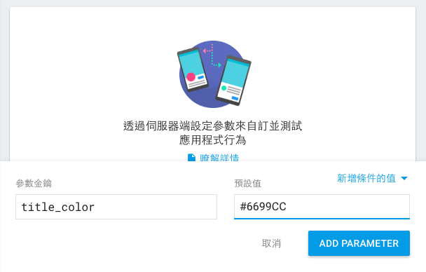
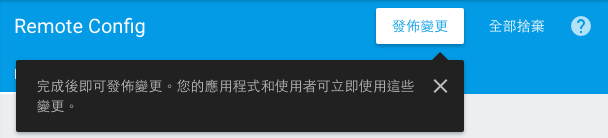

# 即時更新 Config
本章目標為使用 Firebase Remote Config 在遠端設定文字顏色並套用到 App 上。

### Firebase Console
#### Remote Config
回到瀏覽器上剛剛建立的專案，點左邊的「Remote Config」。在右邊的區塊，加入一個新的設定，Key 為 `title_color`，值為 `#6699CC` 或任一你喜歡的色碼。



修改完畢記得要按「發佈變更」才會真的生效。



## res
### menu
#### config_menu.xml
在 `/app/src/main/res/menu` 底下新增這個 xml，並複製貼上取代全部內容。

```
<?xml version="1.0" encoding="utf-8"?>
<menu xmlns:android="http://schemas.android.com/apk/res/android"
      xmlns:app="http://schemas.android.com/apk/res-auto">
    <item
        android:id="@+id/fresh_config_menu"
        android:title="@string/fresh_config"
        app:showAsAction="never"/>
</menu>
```

### 程式
#### java
##### MainActivity.java
展開 `app/src/main/java/com/example/myawesomechat/` 在這找到此名稱的 java 檔案。
以下如果有發現一些編譯前的錯誤，使用「Alt + Enter > Import Class」即可。

在這 Class 中加上下面這兩個 function，這是用來取得剛剛設定的 Config 並設定進去文字顏色。

```
    public void fetchConfig() {
        long cacheExpiration = 3600; // 1 hour in seconds
        // If developer mode is enabled reduce cacheExpiration to 0 so that
        // each fetch goes to the server. This should not be used in release
        // builds.
        // 這裡因為是開發階段才不做 Cache。
        if (mFirebaseRemoteConfig.getInfo().getConfigSettings()
                .isDeveloperModeEnabled()) {
            cacheExpiration = 0;
        }
        mFirebaseRemoteConfig.fetch(cacheExpiration)
                .addOnSuccessListener(new OnSuccessListener<Void>() {
                    @Override
                    public void onSuccess(Void aVoid) {
                        // Make the fetched config available via
                        // FirebaseRemoteConfig get<type> calls.
                        mFirebaseRemoteConfig.activateFetched();
                        applyTextColor();
                    }
                })
                .addOnFailureListener(new OnFailureListener() {
                    @Override
                    public void onFailure(@NonNull Exception e) {
                        // There has been an error fetching the config
                        Log.w(TAG, "Error fetching config: " + e.getMessage());
                    }
                });
    }

    private void applyTextColor() {
        TextView roomName = (TextView) findViewById(R.id.display_name);
        String hexColor = mFirebaseRemoteConfig.getString(TITLE_COLOR_KEY);
        try {

            roomName.setTextColor(Color.parseColor(hexColor));
        } catch(Exception e) {
            Log.e(TAG, "Not a valid color:" + hexColor, e);
        }
    }
```

在 `onStart()` 結尾前加上 `fetchConfig();`

```
    @Override
    public void onStart() {
        super.onStart();
        setupView();

        //新增這段
        fetchConfig();
    }
```

在 `onCreateOptionsMenu(Menu menu)` 內加上 `inflater.inflate(R.menu.config_menu, menu);`
讓選單新增「更新設定」

```
    @Override
    public boolean onCreateOptionsMenu(Menu menu) {
        MenuInflater inflater = getMenuInflater();
        //加上下面這行
        inflater.inflate(R.menu.config_menu, menu);
        //如上
        
        if (mFirebaseUser != null) {
            inflater.inflate(R.menu.sign_out_menu, menu);
        }
        return super.onCreateOptionsMenu(menu);
    }
```

在 `onOptionsItemSelected(MenuItem item)` 加上以下這段在你點下更新時可以去遠端讀取設定

```
    @Override
    public boolean onOptionsItemSelected(MenuItem item) {
        switch (item.getItemId()) {
            case R.id.sign_out_menu:
                mFirebaseAuth.signOut();
                Auth.GoogleSignInApi.signOut(mGoogleApiClient);
                setupView();
                return true;
            //加上以下這段
            case R.id.fresh_config_menu:
                fetchConfig();
                return true;
            //到這邊為止
            default:
                return super.onOptionsItemSelected(item);
        }
    }
```

## 檢查點
執行看看，此時你會看到你設定的顏色已經套用到公開聊天室的文字顏色了。

如果行有餘力，可以換上自己的 google-services.json 進入 console 玩玩看。